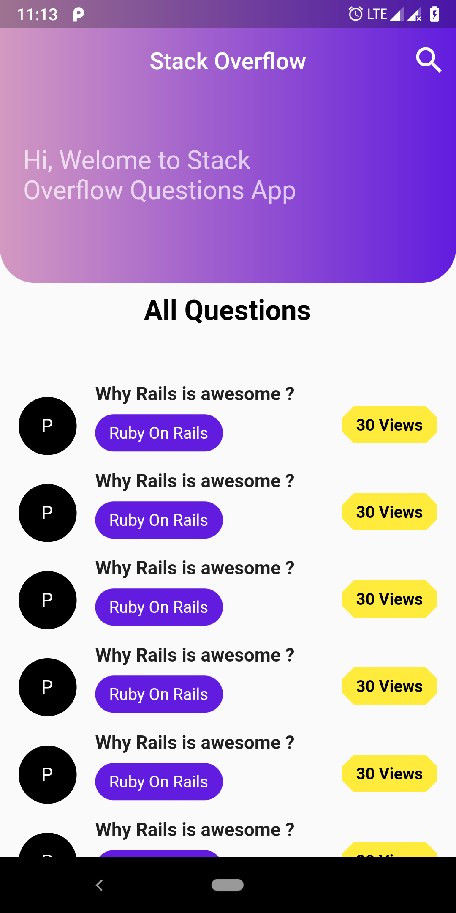

# stack_over_flow

### My app With custom UI ,

A new Flutter project.

## Getting Started

This project is a starting point for a Flutter application.

Thankuou to Mtchvral <3>

A few resources to get you started if this is your first Flutter project:

- [Lab: Write your first Flutter app](https://flutter.io/docs/get-started/codelab)
- [Cookbook: Useful Flutter samples](https://flutter.io/docs/cookbook)

For help getting started with Flutter, view our
[online documentation](https://flutter.io/docs), which offers tutorials,
samples, guidance on mobile development, and a full API reference.
